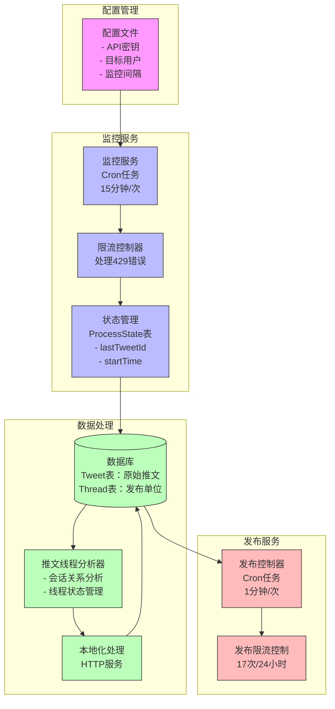

```mermaid
graph TB
    subgraph 配置管理
    Config[配置文件<br/>- API密钥<br/>- 目标用户<br/>- 监控间隔]
    end

    subgraph 监控服务
    Monitor[监控服务<br/>Cron任务<br/>15分钟/次]
    RateLimit[限流控制器<br/>处理429错误]
    LastState[状态管理<br/>ProcessState表<br/>- lastTweetId<br/>- startTime]
    end

    subgraph 数据处理
    ThreadAnalyzer[推文线程分析器<br/>- 会话关系分析<br/>- 线程状态管理]
    Translator[本地化处理<br/>HTTP服务]
    DB[(数据库<br/>Tweet表：原始推文<br/>Thread表：发布单位)]
    end

    subgraph 发布服务
    Publisher[发布控制器<br/>Cron任务<br/>1分钟/次]
    PublishRateLimit[发布限流控制<br/>17次/24小时]
    end

    Config --> Monitor
    Monitor --> RateLimit
    RateLimit --> LastState
    LastState --> DB
    DB --> ThreadAnalyzer
    ThreadAnalyzer --> Translator
    Translator --> DB
    DB --> Publisher
    Publisher --> PublishRateLimit
    
    classDef config fill:#f9f,stroke:#333
    classDef monitor fill:#bbf,stroke:#333
    classDef process fill:#bfb,stroke:#333
    classDef publish fill:#fbb,stroke:#333
    
    class Config config
    class Monitor,RateLimit,LastState monitor
    class ThreadAnalyzer,Translator,DB process
    class Publisher,PublishRateLimit publish
``` 