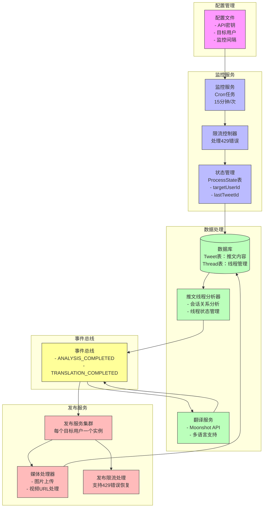

## 系统架构

Twitter Mirror 是一个自动化的推文监控、翻译和发布系统。系统采用事件驱动架构，通过事件总线实现服务间的解耦和协作。

### 架构图

### 核心组件

1. **监控服务 (Monitor)**
   - 唯一保留Cron任务的服务，每15分钟执行一次
   - 负责获取目标用户的最新推文
   - 包含限流处理机制，支持429错误的优雅恢复
   - 使用ProcessState表跟踪每个目标用户的最后处理状态

2. **事件总线 (EventBus)**
   - 系统的核心协调组件
   - 支持的关键事件：
     - ANALYSIS_COMPLETED: 线程分析完成
     - TRANSLATION_COMPLETED: 翻译完成
   - 实现服务间的解耦和异步通信

3. **线程分析器 (ThreadAnalyzer)**
   - 分析推文之间的会话关系
   - 构建完整的推文线程
   - 事件驱动，不再使用定时任务
   - 发送ANALYSIS_COMPLETED事件

4. **翻译服务 (Translator)**
   - 监听ANALYSIS_COMPLETED事件
   - 使用Moonshot API进行文本翻译
   - 支持多语言配置
   - 发送TRANSLATION_COMPLETED事件

5. **发布服务 (Publisher)**
   - 每个目标用户独立的发布服务实例
   - 监听TRANSLATION_COMPLETED事件
   - 支持媒体处理：
     - 图片：直接上传到Twitter
     - 视频：将URL添加到推文文本
   - 包含限流处理机制，支持429错误的自动重试

6. **数据存储**
   - Thread表：管理推文线程
   - Tweet表：存储推文内容和翻译
   - ProcessState表：记录每个目标用户的处理状态

### 工作流程

1. Monitor服务定期检查新推文
2. 发现新推文后保存到数据库
3. ThreadAnalyzer分析并构建线程
4. 通过事件触发翻译服务
5. 翻译完成后触发对应的发布服务
6. 发布服务处理媒体并发布推文

### 错误处理

1. **限流处理**
   - 所有API调用都包含429错误处理
   - 基于响应头的reset time进行等待
   - 自动重试机制

2. **状态管理**
   - 完整的状态转换验证
   - 失败状态的记录和恢复
   - 支持手动触发重试

### 辅助工具

1. **重试脚本**
   - retry-failed-tweets.ts: 重试失败的推文发布
   - trigger-translation.ts: 手动触发翻译流程

2. **监控工具**
   - 完整的日志系统
   - 状态追踪
   - 错误报告 